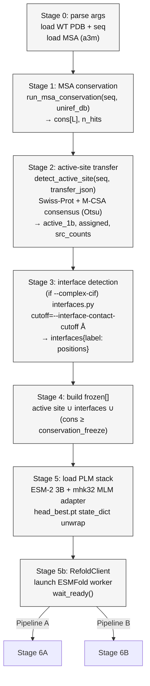
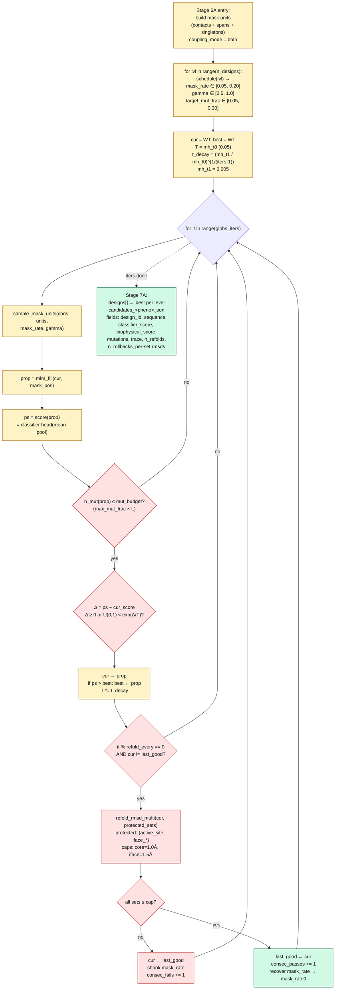
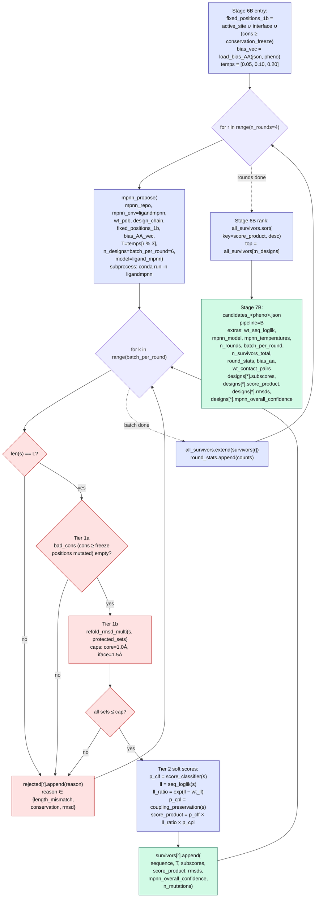

# Generation pipeline architecture — A vs B

Head-to-head diagrams of the two generative pipelines that share Stages 0–5 and
diverge at Stage 6 (design loop). Both target IS621 (8WT6 chain A, 306 aa) and
consume the same mhk32 adapter + per-phenotype `head_best.pt` classifier.

- **Pipeline A** — `scripts/11_generate.py`: MLM-in-the-loop Gibbs+MH sampler
  with periodic refold + RMSD rollback (single hard fold gate; classifier score
  is the acceptance signal).
- **Pipeline B** — `scripts/11_generate_pipelineB.py`: LigandMPNN-in-the-loop
  proposer with per-round temperatures, per-candidate refold + RMSD hard gate,
  and a multiplicative soft score (classifier × seqLL ratio × coupling).

Companion sbatch wrappers:
`scripts/slurm/11_generate_is621.sbatch` (A) and
`scripts/slurm/11_generate_is621_pipelineB.sbatch` (B), both `time=48:00:00`.

---

## Shared front matter (Stages 0–5)

Notes:
- Conservation threshold defaults to 0.90 in both pipelines
  (`--conservation-freeze 0.90`).
- Active-site RMSD cap = `--core-rmsd-cap` (default 1.0 Å in both).
- Interface RMSD cap = `--interface-rmsd-cap` (default 1.5 Å in both).
- `head_best.pt` load path unwraps the checkpoint dict (`state_dict` key) —
  fix applied in both scripts (2026-08-19).

---

## Pipeline A — Gibbs + Metropolis-Hastings

`scripts/11_generate.py` — MLM-in-the-loop proposer, contact/span-coupled
masking, classifier-score acceptance with periodic refold rollback.

**Key parameters (defaults):**
- `--n-designs 3` (aggressiveness levels)
- `--gibbs-iters 24`
- `--mh-t0 0.05 --mh-t1 0.005` (geometric anneal per level)
- `--refold-every 4`
- `--mask-rate` schedule 0.05 → 0.20 across levels
- `--max-mut-frac 0.30` (hard cap on residues changed)
- `coupling_mode=both` — contact-pair + span-length units

**Acceptance geometry:** score is directional (classifier alone), fold is
gated periodically (every 4 iters); a run can *end below its peak* under MH,
so `best` is tracked separately and returned as the design.

---

## Pipeline B — MPNN-in-the-loop with hard/soft two-tier gate

`scripts/11_generate_pipelineB.py` — LigandMPNN proposer over `n_rounds`
rounds at cycling temperatures, per-candidate refold + RMSD *hard* gate,
then a multiplicative *soft* score product for ranking.

**Key parameters (defaults):**
- `--n-rounds 4 --batch-per-round 6` → up to 24 candidates/run
- `--temperatures 0.05,0.10,0.20` (cycled by round mod len)
- `--n-designs 3` (top-K after ranking survivors)
- `--conservation-freeze 0.90`
- `--core-rmsd-cap 1.0 --interface-rmsd-cap 1.5`
- `--mpnn-model ligand_mpnn` (LigandMPNN v1)
- `--bias-aa-json data/bias_aa_by_phenotype.json`

**Acceptance geometry:** every proposal is folded and gated (no periodic
skipping), and the ranker is a *product* of three sub-scores, so a design
must be plausible under the classifier, close to WT under the language
model, AND preserve WT contact patterns to rank at all.

---

## What changed vs `docs/generation_pipeline.md`

The older `generation_pipeline.md` predates the mhk32 adapter refactor and
describes MPNN as an out-of-loop gate on top of Gibbs. This document reflects
the current scripts:

| Aspect | Old doc | Pipeline A (now) | Pipeline B (now) |
|---|---|---|---|
| Proposer | ESM-2 + adapter | ESM-2 + mhk32 adapter | LigandMPNN (subprocess) |
| Acceptance | classifier score | classifier + MH anneal | product (clf × llR × cpl) |
| Fold gate | out-of-loop MPNN + refold | in-loop refold every 4 iters | in-loop refold per candidate |
| Rollback | discard-only | shrink mask_rate + revert | reject-only (no revert) |
| Composition bias | – | – | per-phenotype bias_AA vector |
| Interfaces | active-site only | active + per-interface RMSD | active + per-interface RMSD |

## Progress monitoring rubric (all 4+4 jobs, 48 h walltime)

- Pipeline A logs: `is621_gen_<JOBID>.log`, line format
  `[gen] iter=<i>/24 accept=<n> ...` — expect ~24 iters × 3 levels per pheno.
- Pipeline B logs: `is621_genB_<JOBID>.log`, line format
  `[genB] === round <r>/4 batch=6 T=<T> ===` — expect 4 rounds × 6 candidates.
- `squeue -u $USER -o '%.10i %.16j %.10L'` for remaining walltime.
- If a first Pipeline A iter > 20 min or a first Pipeline B round > 30 min,
  48 h may still be tight; log the rate and check back at ~1 h.

## Currently deployed job IDs (2026-08-19)

| Job | Script | Phenotype |
|---|---|---|
| 1178426 | 11_generate.py (A) | thermophile |
| 1178427 | 11_generate.py (A) | halophile |
| 1178428 | 11_generate.py (A) | hyperthermophile |
| 1178429 | 11_generate.py (A) | alkaliphile |
| 1178430 | 11_generate_pipelineB.py (B) | thermophile |
| 1178431 | 11_generate_pipelineB.py (B) | halophile |
| 1178432 | 11_generate_pipelineB.py (B) | hyperthermophile |
| 1178433 | 11_generate_pipelineB.py (B) | alkaliphile |

All 8 running on `gpu_h200 node-224-2t-8gpu-1` at 48 h walltime.
