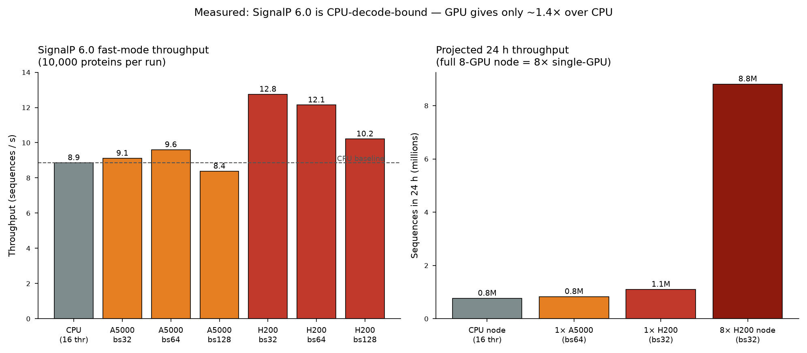
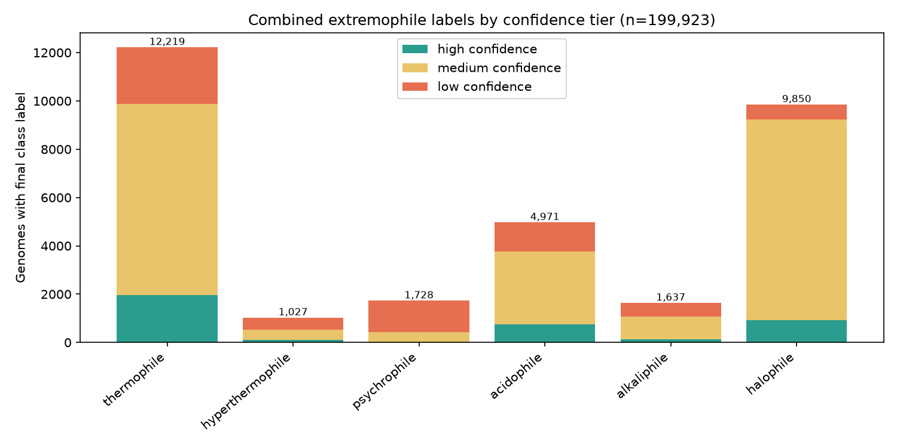
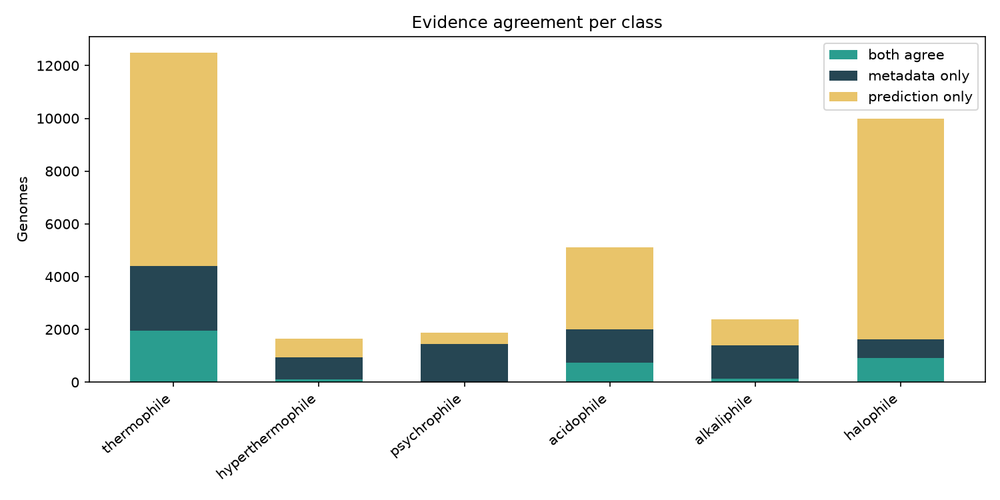
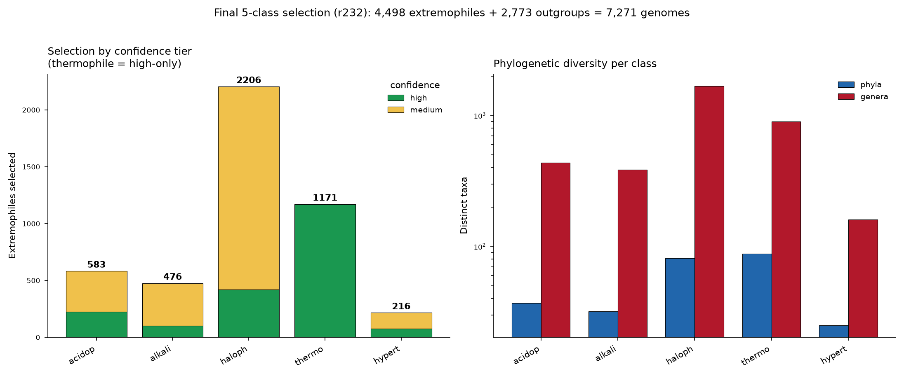
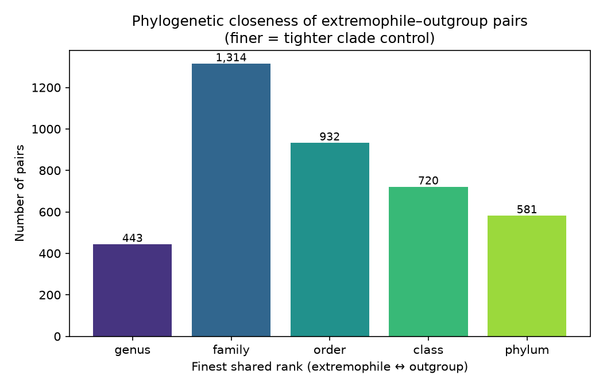
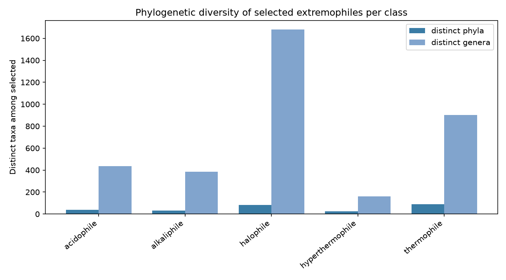
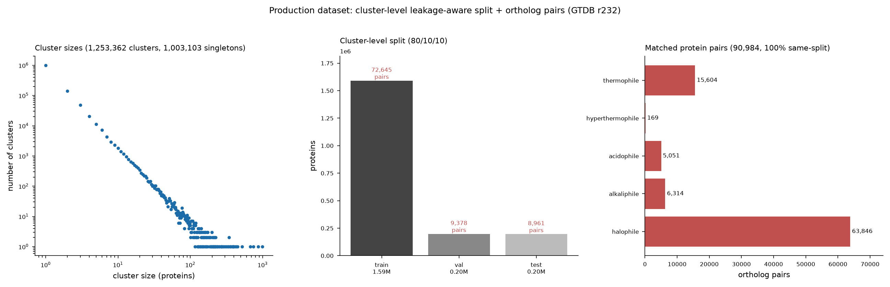

# Lab Notebook — Extremophilic Protein Translator

A running log of pipeline development: steps taken, key metrics, and figures.
Newest entries are appended at the bottom. For *what the pipeline is*, see
[README.md](README.md); this file records *what was actually done and found*.

- **Project:** database of secreted proteins from GTDB extremophiles for
  protein-language-model fine-tuning.
- **Data release:** GTDB **r232**.
- **Compute:** biotite SLURM cluster (`/groups/cress/projects/jaymin/IS1111/`);
  data pre-downloaded and pre-parsed. SignalP 6.0 installed on biotite.

---

## Summary metrics (running)

| Metric | Value |
|--------|-------|
| GTDB release | r232 |
| Species representatives (total) | **199,923** |
| — Bacteria | 189,801 |
| — Archaea | 10,122 |
| Reps with `ncbi_isolation_source` | 94,977 (48%) |
| Reps with isolation-source extremophile flag | 9,492 |
| Reps with organism-name extremophile signal | 12,193 |

---

## Stage 01 — GTDB indexing

**Goal:** parse GTDB r232 metadata, filter to species representatives, and
build accessors mapping each genome to its on-disk proteome / genome files.

**What was done**
- Verified the on-biotite data layout matches the documented conventions
  (`gtdb/` metadata + per-genome `.faa.gz`/`.fna.gz`, `work/` combined FASTA +
  coords + genome index). All file-format conventions confirmed:
  - genome id keeps GTDB prefix (`GB_`/`RS_`); combined FASTA headers are
    `>{GENOME}~{PROTID}`; `genome_index.tsv` is headerless `<bare_acc>\t<abs_path>`.
- Wrote `src/eptrans/gtdb.py`: metadata parsing, representative filter,
  taxonomy expansion (`d__…;p__…` → per-rank columns), and a `GenomeIndex`
  accessor that resolves an accession to its `.faa.gz` and `.fna.gz` paths.
- `scripts/01_index_gtdb.py` produces `results/gtdb_reps_metadata.parquet` and a
  per-phylum bar chart.

**Key metrics**
- **199,923** species representatives (189,801 bacteria + 10,122 archaea) —
  internally consistent with the 199,923-row `genome_index.tsv` (1:1 coverage).
- Metadata: 113 columns; environment proxy is `ncbi_isolation_source` (col 62).
- QC fields available: `checkm2_completeness`, `checkm2_contamination`
  (defaults: completeness ≥ 90, contamination ≤ 5).

**Figure** — representatives per phylum (validation sample; the full run
produces the same over all reps):

**Validation:** parser tested on a staged r232 metadata sample (51 reps),
robust to embedded newlines in free-text NCBI fields. 6 unit tests pass
(`tests/test_gtdb.py`).

---

## Stage 01b — Metadata-based extremophile flagging

**Goal:** map isolation-source (and, weakly, organism-name) text to candidate
extremophile classes, with retained evidence strings for auditability.

**What was done**
- Built a curated keyword dictionary in `src/eptrans/binning.py`, grounded in
  the *actual* r232 isolation-source vocabulary (tabulated the most common
  values first). Classes: thermophile, hyperthermophile, psychrophile,
  acidophile, alkaliphile, halophile.
- Handled deliberate ambiguities:
  - `soda lake` → **halophile + alkaliphile** (hypersaline *and* alkaline)
  - `salt marsh` (tidal) → **not** halophile; `basalt` → not halophile
  - `cold seep` → **not** psychrophile (ambient deep-sea, not cold-adapted)
  - `hydrothermal sulfide chimney` → thermophile + hyperthermophile
- Organism-name signals collected **separately and down-weighted**, because
  genus names correlate with clade and would leak phylogeny into the label.
- Every match retains the substring that triggered it (`*_evidence` columns).
- `scripts/01b_flag_metadata.py` → `results/metadata_flags.parquet` + figure.

**Key metrics** (of 199,923 reps; isolation-source evidence)

| Class | isolation-source | organism-name |
|-------|-----------------:|--------------:|
| thermophile | 4,415 | 3,690 |
| hyperthermophile | 949 | 52 |
| psychrophile | 1,454 | 681 |
| acidophile | 1,999 | 6,649 |
| alkaliphile | 1,394 | 422 |
| halophile | 1,617 | 1,642 |

**Figure** — metadata flags by class (left: isolation source split by domain;
right: isolation-source vs organism-name evidence):

**Observation / design validation:** for **acidophile**, organism-name evidence
(6,649) far exceeds isolation-source evidence (1,999) — largely the genus
`Acidobacterium` / class `Acidobacteriae`, i.e. taxonomic names rather than
habitat. This is exactly the clade-vs-trait confound the pipeline guards
against, and why organism-name signals are never used alone for a confident
label. Archaea are enriched in thermophile / hyperthermophile / halophile
classes, as expected.

---

## Stage 02 — GenomeSPOT wrapper + prediction parsing

**Goal:** wrap GenomeSPOT to predict temperature / pH / salinity / oxygen from a
genome's DNA + protein FASTA, and parse its output into a tidy per-genome table.

**What was done**
- Installed GenomeSPOT (Barnum et al. 2024) into a dedicated `genomespot` env
  with the **critical** pins: `scikit-learn==1.2.2` (README: essential — models
  mispredict on other versions) and `hmmlearn==0.3.0`.
- Wrote `src/eptrans/genomespot.py`: subprocess wrapper around
  `python -m genome_spot.genome_spot` + parsers for `.predictions.tsv` /
  `.predictions.json`. Flattens 10 targets × {value, error, is_novel, warning}
  into a per-genome row, plus a `__suspect` flag per trait.
- Handled interpretation subtleties: `is_novel` (features unusual vs 98% of
  training data) and `warning` clamping — a `min_exceeded` on salinity min /
  optimum at 0 is benign and explicitly **not** flagged suspect.
- `scripts/02_run_genomespot.py`: serial/local driver over an accession list
  using the `GenomeIndex` accessors.

**Validation** — ran on the shipped test genome `GCA_000172155.1`; output
reproduces the README reference exactly:

| target | value | error | flag |
|--------|------:|------:|------|
| temperature_optimum | 22.95 °C | 6.48 | — |
| ph_optimum | 7.07 | 0.91 | — |
| salinity_optimum | 0.20 % w/v | 1.94 | — |
| salinity_min | 0 | 1.18 | min_exceeded (benign) |
| oxygen | tolerant | 0.974 | — |

6 parser tests added; **32 tests total passing**. GenomeSPOT repo + models
archived as an artifact (`genomespot_repo.tar.gz`) for reproducible reuse.

---

## Stage 02b — Reconcile precomputed GenomeSPOT predictions

**Goal:** reuse the GenomeSPOT paper's precomputed predictions (GTDB **r214**)
for r232 reps, compute the recompute **delta**, and emit a reconciled TSV with
genome absolute paths.

**What was done**
- Established that the paper applied GenomeSPOT to GTDB **r214** (abstract:
  "all 85,205 species"). The per-genome predictions are **not** in the repo; the
  `analyze_all_species` notebook reads them from a local `data/predictions_gtdb/`
  and merges to a table it calls `supplementary_data_4.tsv` (presumed the paper's
  Supplementary Data 4).
- Wrote `src/eptrans/reconcile.py` with **three-tier accession matching**
  (strongest first), recording which level matched for auditability:
  1. `exact` — full bare accession incl. source prefix + version
  2. `noversion` — GCA/GCF + numeric, ignoring `.version` (version bumps)
  3. `assembly` — numeric id only (bridges GenBank↔RefSeq `GCA`↔`GCF`)
- r232 reps with no match → **delta** (need fresh GenomeSPOT); precomputed rows
  matching no r232 rep → **dropped** (organism no longer a rep).
- `attach_genome_paths()` adds absolute `.fna.gz` paths from `genome_index.tsv`.
- `scripts/02b_reconcile_predictions.py` emits the reconciled TSV (+ delta
  accession list, stats JSON, summary figure).

**Validation** — the true reuse fraction needs the real Supp Data 4 (bioRxiv
supplementary blocked from this environment; pending user download). Verified
end-to-end on a **synthetic precomputed set** built from real r232 accessions
with injected version-bumps and GCA↔GCF swaps (75% coverage, 3,000 dropped rows):

| bucket | count | note |
|--------|------:|------|
| reuse: exact | 89,965 | identical accession |
| reuse: noversion | 29,989 | version bump |
| reuse: assembly | 29,988 | GCA↔GCF swap |
| delta (recompute) | 49,981 | not in precomputed |
| dropped precomputed | 3,000 | not a rep in r232 |

All 199,923 genome paths attached. 8 reconcile tests added; **40 tests total**.

> **Note:** figure/counts above are the synthetic validation. Real r214→r232
> reuse fractions will be produced once Supplementary Data 4 is loaded.

---

## Stage 03 — Combined environmental binning logic

**Goal:** reconcile the two independent evidence sources (metadata flags +
GenomeSPOT predictions) into a final per-class extremophile label with a
confidence tier, plus a `confident_mesophile` flag for outgroup selection.

**Combination rule** (`eptrans.binning.combine_label`):

| metadata | prediction | → label | confidence |
|----------|-----------|---------|-----------|
| class X | class X | X | **high** (agree) |
| — | class X | X | **medium** (prediction only) |
| class X | — / conflict | X | **low** |
| — | — | (none) | none |

- `confident_mesophile` = all predicted optima inside the mesophile envelope
  (temp 20–40 °C, pH 6–8, salinity ≤3 % w/v) **and** no metadata extremophile
  flag — the pool from which phylogenetically-matched outgroups are drawn.
- `scripts/03_combine_bins.py` writes `combined_labels.{parquet,tsv}` with
  per-class booleans, final label, confidence, and mesophile flag; plus two
  figures (class counts by tier; metadata-vs-prediction agreement per class).

**Validation** (metadata flags + *synthetic* predictions, n=199,923): pipeline
runs end-to-end; with random synthetic predictions "both agree" is minimal and
"prediction only" dominates (expected for random data). Real GenomeSPOT
predictions will concentrate agreement in the metadata-flagged classes. Figures:

> Counts are synthetic-prediction placeholders; final numbers await real
> GenomeSPOT predictions (Supp Data 4 + delta recompute).

---

## Stage 04 — Phylogenetically-controlled genome selection

**Goal:** satisfy the two competing methodological constraints so the downstream
model learns the *trait*, not the *clade*:
1. **Diversity** — extremophiles for each class span the tree (cap picks per
   lineage so no clade dominates).
2. **Matched outgroups** — each extremophile paired with a phylogenetically
   *close* confident mesophile (same genus → family → … ), so extremophile and
   mesophile can't be separated by clade alone.

**What was done** (`src/eptrans/selection.py`)
- `select_extremophiles()`: diversity cap of N per lineage-rank (default 5 per
  family), preferring high-confidence labels.
- `find_outgroup()`: walks genus → family → order → class → phylum, returning
  the closest unused confident mesophile and recording the matched rank.
- `select_with_outgroups()`: full pipeline → extremophiles, outgroups, pairs.
- `scripts/04_select_genomes.py` writes the four tables + two figures.

**Validation** (synthetic combined labels; 100 per class, cap 5/family):

| metric | value |
|--------|------:|
| extremophiles selected | 600 |
| outgroups matched | 598 / 600 |
| pairs sharing **genus** | 302 |
| pairs sharing **family** | 221 |
| pairs sharing order/class/phylum | 41 / 25 / 9 |

Selected extremophiles per class span **21–36 distinct phyla** and ~88–96
distinct genera — high diversity with tight per-pair clade matching.

8 selection tests added; **48 tests total**.

---

## Stage 05 — SignalP 6.0 wrapper + secreted-protein extraction

**Goal:** identify and extract secreted / cell-surface-exposed proteins (those
carrying a signal peptide) from the selected genomes' proteomes.

**Secreted definition:** SignalP 6.0 class ∈ {SP, LIPO, TAT, TATLIPO, PILIN}
(i.e. any predicted signal peptide; class `OTHER` = not secreted).

**Host reconnaissance (biotite)**
- SignalP 6.0 is a **pyenv shim** (`/home/jayminp/.pyenv/shims/signalp6`,
  pyenv 3.11.3), **not** on the default non-login PATH. Jobs must
  `export PYENV_ROOT="$HOME/.pyenv"; export PATH="$PYENV_ROOT/bin:$PYENV_ROOT/shims:$PATH"` first.
- Confirmed CLI:
  `signalp6 --fastafile <faa> --output_dir <dir> --format {txt,none} --organism other --mode {fast,slow}`.
- ⚠️ **Model weights are not installed** — `signalp/model_weights/` contains only
  a README (no `.pt` files), so no mode can currently run (fast mode errors on the
  missing distilled model). The weights are license-gated (DTU academic download)
  and must be installed on the host before real runs.

**What was done**
- `src/eptrans/signalp.py`: parser for `prediction_results.txt` (exact format
  taken from the installed SignalP source), `SignalPrediction` dataclass with
  `is_secreted`, `extract_secreted()` (precursor or mature chain via cleavage
  site), `summarize()`, and command builder.
- `scripts/05_run_signalp.py`: `--emit-slurm` writes a SLURM array job (pyenv
  export baked in; decompresses `.gz` proteomes; one genome per array task); the
  default mode parses per-genome outputs → secreted-protein FASTA
  (`>{GENOME}~{PROTID}` headers) + per-protein table + summary JSON.

**Validation** (parser + extraction on a synthetic SignalP output set that
reproduces the exact 6.0 format): 2 genomes, 5 proteins → 3 secreted (60%);
class filtering, cleavage-site math (mature = residues after cleavage), and
`{GENOME}~{PROTID}` headers all correct. `--emit-slurm` generated a 600-task
array over the selected extremophiles. 7 signalp tests; **55 tests total**.

---

## Stage 06 — labeled dataset assembly with leakage-aware splits

**Goal:** join secreted proteins (stage 05) to genome environmental classes
(stage 03), producing a protein-level supervised dataset for PLM/classifier
fine-tuning, with splits that don't leak homologs across train/val/test.

**What was done**
- `src/eptrans/dataset.py`: `assign_labels()` (each secreted protein inherits its
  source genome's class, or `mesophile` for a confident-mesophile outgroup),
  `stratified_group_split()` (whole groups → one split, stratified by group
  majority label), `assemble_dataset()` (groups = mmseqs sequence clusters when a
  cluster map is supplied, else genome-level fallback).
- **Two leakage controls**: (1) sequence-similarity — near-duplicate secreted
  proteins (mmseqs cluster) never span splits; (2) genome memorization — all
  proteins of one genome share a split. Enforced by assertion
  (`max_splits_per_group == 1`).
- `scripts/06_assemble_dataset.py`: dataset parquet/TSV + stats.json + per-split
  count figure.

**Validation:** 5 dataset tests including the no-leakage guarantee and the
cluster-map homolog test (a shared cluster lands entirely in one split).
(Full suite after all stages below: **65 tests passing**.)

---

## Stage 05b — SLURM scaling under biotite QOS limits

**biotite `standard` QOS (verified via scontrol/sacctmgr):** MaxJobsPerUser=10
(running array tasks), MaxSubmitJobsPerUser=200 (queued+running), MaxArraySize=1001.

- `src/eptrans/slurm.py`: `plan_array()` sizes chunked arrays so n_tasks ≤ 200,
  throttled `%10`; auto-grows chunk-size to fit.
- `scripts/05_run_signalp.py` and `scripts/02_emit_genomespot_slurm.py` both emit
  chunked arrays: GenomeSPOT uses `xargs -P <cpus>` intra-node (1 genome/invocation,
  ~5s each); SignalP concatenates a chunk's proteomes into one FASTA (headers
  namespaced `GENOME~PROTID`) and uses internal batching (`--torch_num_threads`,
  `--write_procs`, `--bsize`).
- Full scale (199,923 genomes): 200 tasks × 1000/task × 16 cores, `--array=0-199%10`.
- **Compute-time note:** GenomeSPOT ~5s/genome. At 16 cores/task × 10 running
  tasks (160-way) → ~105 min wall for all genomes; at 48 cores/task → ~35 min.
  Reusing the paper's precomputed r214 predictions (Supp Data 4) would cut the
  recompute to the delta (~4× saving), but recompute is cheap CPU work — the user
  chose the recompute path.

---

## Stage 07 — end-to-end local pilot

**Goal:** run the whole chain on a small, phylogenetically-diverse real genome
set and confirm each stage produces sensible output.

**Pilot set** (`data/pilot_genomes.tsv`, 14 genomes): 2 each of hyperthermophile,
psychrophile, acidophile, alkaliphile, halophile + 1 thermophile + 3 mesophiles,
spanning 4 GTDB phyla (Acidobacteriota, Actinomycetota, and two candidate phyla),
with real isolation sources (deep-sea hydrothermal vent, ice core, acid mine
drainage, hypersaline soda lake, alkaline hot spring). All 14 confirmed in the
genome index (fna + proteome paths).

**GenomeSPOT (real predictions):** ran locally on all 14 (repo + models + pinned
env), 14/14 in ~45 s. Predictions are biologically sensible and demonstrate the
value of the combination approach:
- Acidophiles (acid mine drainage) → pH optima **3.4 / 5.0** ✓
- Halophile (hypersaline soda lake) → salinity **6.0 %**, pH **9.2** ✓
- Psychrophile (ice core, *Cryobacterium*) → temp optimum **17.4 °C** ✓
- **"Hyperthermophiles"** (metadata: deep-sea vent) → GenomeSPOT predicts only
  **40–48 °C**, *not* hyperthermophilic — the "isolated-from ≠ thrives-at" case
  the design guards against. These correctly fall to low confidence.

**Combined binning (real):** 14 genomes → confidence tiers **high 3 / low 8 /
none 3**; 1 confident mesophile. High-confidence = the acidophiles + halophile
where metadata and prediction agree.

**Selection:** at 14-genome scale only 1 confident mesophile exists, so only 1
extremophile could be phylo-matched to an outgroup (logic exercised; matched
pool is a scale artifact of the pilot, not a defect).

**SignalP (real):** the full pilot proteome is **47,972 proteins**; SignalP 6.0
fast mode runs at ~1.7 seq/s on CPU (~8 h for the full set), so the pilot
subsamples to 150 proteins/genome (**2,100 total**) and runs as a SLURM batch job
(job 1149752, `COMPLETED` in 3:57 on a `standard` node, 16 threads). Result:
**323 / 2,100 secreted (15.4 %)** — a biologically reasonable signal-peptide
fraction. By class: **208 SP (Sec/SPI), 103 LIPO (Sec/SPII), 6 TAT, 6 TATLIPO,
0 PILIN**. All 14 genomes contribute secreted proteins (4–29 % per genome).
(SignalP model weights confirmed installed by the user.)

**Dataset assembly (real):** 268 secreted proteins across 12 genomes labeled by
environmental class (hyperthermophile 66, thermophile 65, psychrophile 36,
halophile 34, acidophile 33, alkaliphile 19, mesophile 15). Leakage check passed
(no genome spans multiple splits). At pilot scale (~2 genomes/class) the
stratified group split puts everything in train — `round(2 × 0.1) = 0` for
val/test — which is expected small-n rounding, not a logic error: a 30-genome
demo yields the correct 120/15/15 train/val/test with zero leakage.

**Pilot figures**
- `results/pilot_env_predictions.png` — predicted OGT / pH / salinity per genome,
  colored by metadata-implied class, with class-threshold guide lines.
- `results/pilot_phylo_spread.png` — phylum × class grid colored by combined
  confidence tier.
- `results/pilot_combined_label_counts.png`, `results/pilot_combined_agreement.png`
  — per-class label counts and metadata/prediction agreement.
- `results/pilot_secreted_counts.png` — SignalP secreted fraction per genome,
  colored by class.
- `results/pilot_dataset_splits.png` — labeled-dataset class counts per split
  (all-train at pilot scale; see note above).

## SignalP throughput benchmark (measured)

Benchmarked SignalP 6.0 fast mode on 10,000 proteins across CPU / A5000 / H200:

| Config | best seq/s | per-GPU 24 h |
|--------|-----------:|-------------:|
| H200 (bsize 32) | **12.75** | 1.10 M |
| A5000 / `gpu` (bsize 64) | 9.60 | 0.83 M |
| CPU `standard` (16 threads) | 8.86 | 0.77 M |

**Key finding: GPU gives only ~1.4× over CPU (H200), ~1.1× (A5000).** SignalP 6.0
fast mode is **CPU-decode-bound**, not GPU-bound — the transformer runs on short
N-terminal windows, so the GPU idles while CPU-side CRF decoding and result
assembly set the pace. Larger batch sizes were *slower* (padding waste). **Verdict:
run SignalP on `standard` (CPU), not the GPU partitions** — no speedup, worse queue.

**Scale consequence:** all 199,923 reps ≈ 685 M proteins → 30–80 days at any of
these rates (infeasible). The phylo-controlled **selection** stage exists to avoid
this: SignalP runs only on the selected subset (~100 genomes/class × 6 + outgroups
≈ 1–1.5 k genomes ≈ 4–5 M proteins). At the `standard` CPU node's measured
480-way rate (~266 seq/s), that is **~4–5 h**; the GPU partitions are no faster
per unit and have worse queues, so `standard` is the right target. Production
order: GenomeSPOT-all → bin → **select** → SignalP-on-selected.

**End-to-end status:** the full chain runs — GTDB metadata → flag → GenomeSPOT →
combine → select → SignalP → labeled dataset — on real data, producing a
268-protein labeled secreted-protein dataset from 12 genomes (of the 14 pilot
genomes; 2 fell outside the labeled classes). At production
scale the same scripts run via the chunked SLURM emitters.
- **Stage 06** — labeled dataset assembly (leakage-aware splits).
- **Pilot** — end-to-end run on a small genome set + report.

## Full-scale production run (GenomeSPOT complete)

- **GenomeSPOT on all 199,923 r232 reps — DONE.** SLURM array (20 tasks ×
  10,000 genomes × 48-way `xargs`, `%10` throttle; job 1149841). All 20 chunks
  reported "done (10000 outputs)"; queue empty. Per-task ~46 min (~13 s/genome
  effective on real genomes, higher than the 5 s test genome). Outputs:
  `eptrans_scratch/genomespot/chunk_*/<acc>.predictions.tsv` (per-genome
  long-format, 10 targets).
- **Aggregation** (`aggregate_genomespot.py`, SLURM job 1149958): pivots the
  ~200 k per-genome long-format files to one wide row each (10 targets ×
  value/error/warning), joins genome absolute `.fna.gz` paths from
  `genome_index.tsv` (this folds in the 02b path-attachment), writes
  `genomespot_predictions_r232.tsv` with headers. Reading 200 k tiny files off
  VAST is I/O-bound; run as a batch job, not interactive SSH.

## Phase 1 localization enrichment

Per user (retain signal type + mature chain; defer TM topology): added an
`anchoring` field derived from SignalP class — **soluble** (SP, TAT: Sec/Tat
cleaved, released) vs **membrane_anchored** (LIPO, TATLIPO, PILIN: lipobox /
pilin, extracellular-facing but membrane-tethered) vs **none** (OTHER:
cytoplasmic or transmembrane — indistinguishable without a topology tool). The
secreted per-protein table now carries `signalp_class, anchoring, cs_after,
cs_prob` + per-class probs; `dataset.assign_labels` passes these through. TM
extracellular-loop extraction (DeepTMHMM/Phobius) is deferred to a later phase.

_Infrastructure notes: biotite SSH + scratch dir + GitHub credential all
configured. Job submission via SLURM (`standard`/`memory`/`gpu` partitions).
biotite SSH latency is intermittently high — trivial `squeue`/`find` calls can
hang past the 560 s ceiling; prefer batch jobs over interactive SSH for anything
touching the ~200 k-file GenomeSPOT output tree._

## Full-scale binning + final 5-class selection (r232)

**Combined binning** (`03_combine_bins.py --bare-join`) on the real
GenomeSPOT predictions for all **199,923** genomes. The metadata flags keep the
GTDB `GB_`/`RS_` prefix while the aggregated GenomeSPOT TSV uses bare
accessions, so the merge normalizes both sides to the bare form (`--bare-join`).
Confidence tiers: **high 3,638** (metadata + prediction agree), **medium
18,863** (prediction-only), **low 5,499** (metadata-only / conflict), none
171,923; **104,486 confident mesophiles** form the outgroup pool.

**Final selection** (`04_select_genomes.py`) — 5 overlapping classes, chosen
with the user for per-phenotype independent models:

| class | selected | high | medium | phyla | genera |
|---|--:|--:|--:|--:|--:|
| acidophile | 583 | 223 | 360 | 37 | 436 |
| alkaliphile | 476 | 101 | 375 | 32 | 385 |
| halophile | 2,206 | 421 | 1,785 | 81 | 1,680 |
| thermophile (≥50 °C, high-only) | 1,171 | 1,171 | 0 | 88 | 901 |
| hyperthermophile (≥80 °C) | 216 | 76 | 140 | 25 | 161 |

Rules: high+medium confidence (thermophile restricted to high-only to fit the
wall-clock budget), cap 3 genomes/family for diversity, mesophile outgroups
reused across classes (deduplicated). **4,498 unique extremophiles + 2,773
outgroups = 7,271 genomes ≈ 24.9 M proteins.** Diversity is strong in every
class (25–88 phyla, top-phylum share 16–25 %) except hyperthermophile
(49 % Thermoproteota — real biology; hyperthermophily is concentrated in a few
archaeal lineages, which is exactly why its matched mesophile outgroups matter).

Decisions on the hyperthermophile "low" tier: **rejected** (median predicted
optimum 35 °C — isolated-from-hot but not predicted thermophilic; these are the
false positives the combination approach is designed to catch).

**Confidence retained end-to-end** (user: high/medium tiers will weight training
data after SignalP): extremophiles/outgroups TSVs carry `final_confidence`, the
pairs table records both `extremophile_confidence` and `outgroup_confidence`,
and `dataset.assign_labels` stamps `label_confidence` on every secreted protein.

## SignalP production run (job 1149978)

SignalP 6.0 fast mode on all 7,271 selected genomes: **10 array tasks × 750
genomes × 48 threads** (`--array=0-9%10`, standard partition, `--time
72:00:00`, `--mem 48G`, `--bsize 32`), out-root
`eptrans_scratch/signalp_r232`. Estimated ~26 h at ~266 seq/s (480-way);
72 h ceiling is a safety margin (user request). GPU gives no speedup — SignalP
fast mode is CPU-decode-bound (benchmark: H200 only ~1.4× over 16-thread CPU).

_Transfer note: `host.compute.upload()` fails on the /groups VAST mount, and
base64-as-command-argument silently drops large payloads (>~8 KB). Reliable
method: base64 the file, append in ≤6 KB chunks (`printf %s <chunk> >>
file.b64`), then `base64 -d`._

## Reference databases (function-retention oracle)

**Already staged on biotite** (system-wide `/shared/db`, recorded for provenance):

| database | release / pull | path | size |
|---|---|---|---|
| UniRef50 (FASTA) | 2025-11-13 | `/shared/db/uniref/uniref50/latest/uniref50.fasta` | 23 G |
| UniProtKB mmseqs DB (Swiss-Prot + TrEMBL) | 2025_01 | `/shared/db/uniprot/latest/mmseqs/` | 137 G |
| Pfam-A HMMs | r37 | `/shared/db/pfam/latest/Pfam-A.hmm` | 3.4 G |
| Foldseek PDB DB | 2026-02-04 | `/shared/db/foldseek/latest/db/pdb` | 71 M |
| Foldseek AlphaFold DB | 2026-02-04 | `/shared/db/foldseek/latest/db/alphafold_uniprot` | 75 G |

Note: the UniProt mmseqs DB stores **sequences only** — it does not carry the
`ACT_SITE`/`BINDING`/`METAL` feature tables, so the Swiss-Prot flat file is still
required for active-site annotations.

**Staged for this project** (`scripts/download_dbs.sh`, `scripts/download_mcsa.py`):

- **M-CSA** (snapshotted 2026-07-09 via API — flat files are frozen at EBI):
  1,003 entries → **5,201 catalytic-residue rows**, 991 distinct UniProt
  accessions with positions + residue codes + PDB id/chain + catalytic roles, all
  7 EC classes. Saved as `mcsa_catalytic_residues.tsv` (+ full `mcsa_entries.json.gz`).
  This is the tier-1/2 reference for the active-site ladder (direct match +
  homolog transfer).
- **Swiss-Prot flat file** (`uniprot_sprot.dat.gz`, ~950 MB gz): the annotation
  copy with ACT_SITE/BINDING/METAL features. Download on biotite.
- **InterPro** (`entry.list` + `interpro.xml.gz`; optional huge `protein2ipr.dat.gz`
  ~50 GB for full local position mapping — otherwise use the protein-annotation
  MCP connector per-enzyme). Download on biotite.

### Download completion (2026-07-09)

Staged into `eptrans_scratch/db/` (to be relocated to a persistent reference dir):

| database | version | files | size |
|---|---|---|---|
| Swiss-Prot flat file | Release **2026_02** (10-Jun-2026), 575,503 reviewed entries | `uniprot_sprot.dat.gz` (699 MB) + `reldate.txt` | 667 M |
| InterPro | current (54,191 entries) | `entry.list` (2.9 MB) + `interpro.xml.gz` (42 MB) | 43 M |

InterPro `protein2ipr.dat.gz` (~50 GB) intentionally NOT downloaded — per-enzyme
annotation goes through the `mcp-protein-annotation` connector instead.

**Pending relocation** (deferred until project wraps): move `db/` out of scratch
to a persistent reference location; sweep durable scratch products
(`genomespot_predictions_r232.tsv`, parsed SignalP secretome) to persistent
storage; leave `chunk_*` intermediate trees in scratch.

## SignalP merge → master secretome (job 1151569)

The 10 SignalP chunks (job 1149978) were merged into one secretome table +
mature-chain FASTA by `scripts/merge_signalp_chunks.py` (stdlib-only, SLURM job
1151569, `--mature`).

| metric | value |
|---|---|
| proteins scanned | 17,603,649 |
| secreted classified (class ≠ OTHER) | 1,985,565 (11.3%) |
| secreted written to FASTA | **1,985,508** (57 fewer: dropped empty/degenerate mature chains) |
| genomes | 7,268 |
| by class (of 1,985,565 classified) | SP 1,270,289 · LIPO 570,012 · TAT 78,884 · PILIN 49,691 · TATLIPO 16,689 |

Outputs in `IS1111/eptrans/`: `secreted_proteins_r232.tsv` (12 cols, 221 MB),
`secreted_proteins_r232.faa` (mature chains, headers `GENOME~PROTID class=… anchoring=…`, 865 MB).

## Stage 07 — mmseqs clustering for leakage-controlled splits (job 1151585)

`mmseqs easy-cluster` at **50% identity / 80% coverage** (cov-mode 0) on the
secreted mature chains → cluster map used as the split grouping (no homolog
leaks across train/val/test).

| metric | value |
|---|---|
| input proteins | 1,985,508 |
| clusters | 1,253,362 |
| redundancy | 1.58 members/cluster (1.00M singletons, max 987) |

Output: `secreted_clusters_r232_cluster.tsv` (`cluster_rep<TAB>member`, 156 MB).

## Stage 06 (production) — cluster-level labeled dataset

`06_assemble_dataset.py` in cluster regime: split on **clusters** (drop the
genome union-find; clusters already co-locate matched orthologs). Per-protein
`label_confidence` (high/medium/none) retained for training-time weighting.

| metric | value |
|---|---|
| proteins | 1,985,508 |
| split | train 1,590,716 · val 198,322 · test 196,470 |
| derived ortholog pairs (`L_pair`) | **90,984**, 100% same-split by construction |
| pairs by class | halophile 63,846 · thermophile 15,604 · alkaliphile 6,314 · acidophile 5,051 · hyperthermophile 169 |
| extremophile / mesophile proteins | 1,044,442 / 941,066 |

Outputs: `results/labeled_dataset_r232_clustered.parquet` (18 cols),
`_protein_pairs.tsv` (side-car index for the pairwise margin loss).

## Modeling — design + training scaffold

Full design in `docs/modeling_design.md`. Goal: input an enzyme, output the same
activity on a more extremophilic scaffold. Two-stage, per-phenotype design
(§11): **one shared LoRA-adapted ESM-2 3B backbone** (label-agnostic MLM domain
adaptation) → **5 per-phenotype classifier heads** (thermophile,
hyperthermophile, acidophile, alkaliphile, halophile), each vs matched
mesophiles.

`src/eptrans/modeling/` (env `eptrans-ml`: torch / transformers 5.13 / peft 0.19):
- **`masking.py`** — §13 conservation-weighted mask `(1−c)^γ`; active-site freeze
  = γ→∞ limit; **coupling-aware masking** (span + contact-pair via ESM-2's contact
  head) so disulfides/salt-bridges/local structure are masked jointly.
- **`losses.py`** — §12 confidence-weighted masked CE (+ KL guard); weighted/focal
  BCE; matched-pair margin; `L_cls = L_BCE + λ·L_pair`.
- **`model.py`** — LoRA ESM-2 3B, full-attention targets (q/k/v + attention-output
  dense), rank 32 / α 64; mean-pool classifier head.
- **`data.py`** — FASTA join by `tagged_id`; MLM / classifier / pair datasets;
  negative-sampling cap (3× positives); sliding-window truncation guard
  (65,199 chains > 1022, max 30,084).
- **`train.py`** — MLM (bf16 autocast, length-bucket batching, early-stop on val
  pseudo-perplexity) + classifier (model-select on val AUPRC, pair co-loading).

CLI `scripts/08_train_backbone.py` (mlm | classifier), SLURM
`scripts/slurm/08_train_backbone.sbatch`. 27 modeling + 72 pipeline tests pass.

## Stage-1 MLM launch (job 1151972)

Cluster-stratified subsample (`scripts/09_subsample_mlm.py`): dedupe to one
representative per cluster, then **400k train + 20k fixed val**. Domain
adaptation only needs the dominant distributional shift, which a rank-32 LoRA
extracts from a de-redundant fraction of the 1.59M corpus (≈4–5 h/epoch on one
H200 vs ~18 h for the full set). All 420k join cleanly to the mature FASTA;
median mature length 269 aa.

Config: ESM-2 3B, LoRA rank 32 / α 64, bf16, 3 epochs, keep best-by-val-PPL,
gpu:1 on `gpu_h200`. ESM-2 3B weights (11 GB) pre-staged to `$HF_HOME` on the
login node. Submitted as **job 1151972**.

## Background master-secretome fill (job 1151578)

190-task array (`0-189%5`, ~1014 genomes/task) applying SignalP to the remaining
192,652 GTDB representatives, building a whole-GTDB master secretome over ~1–2
months without crowding foreground work. Resumable (per-chunk `.done` sentinel).
