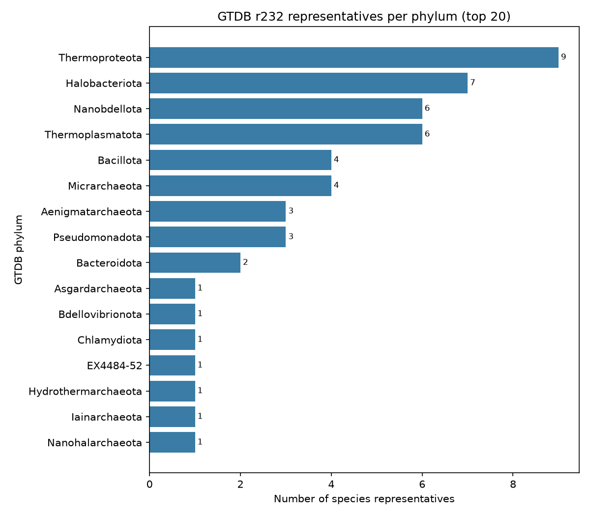
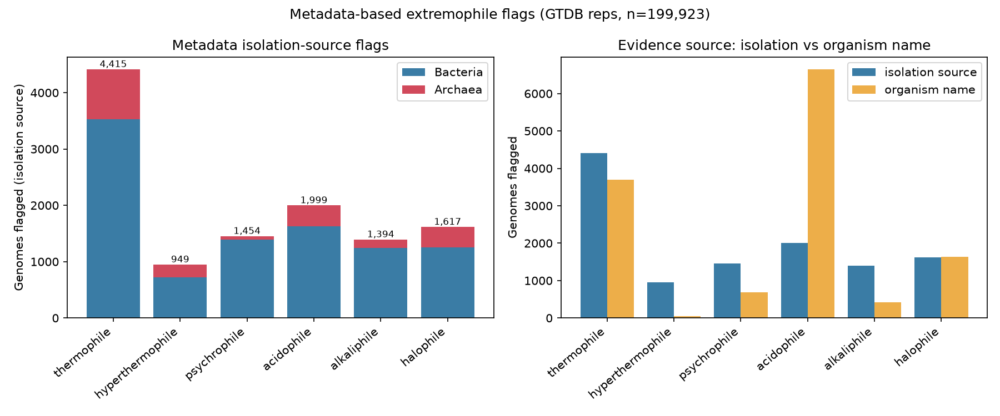
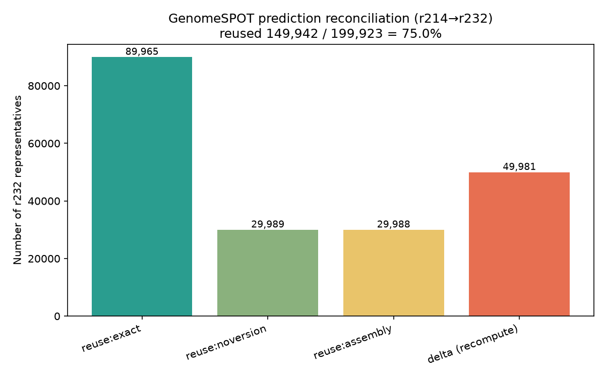
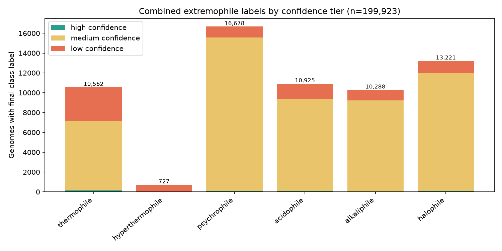
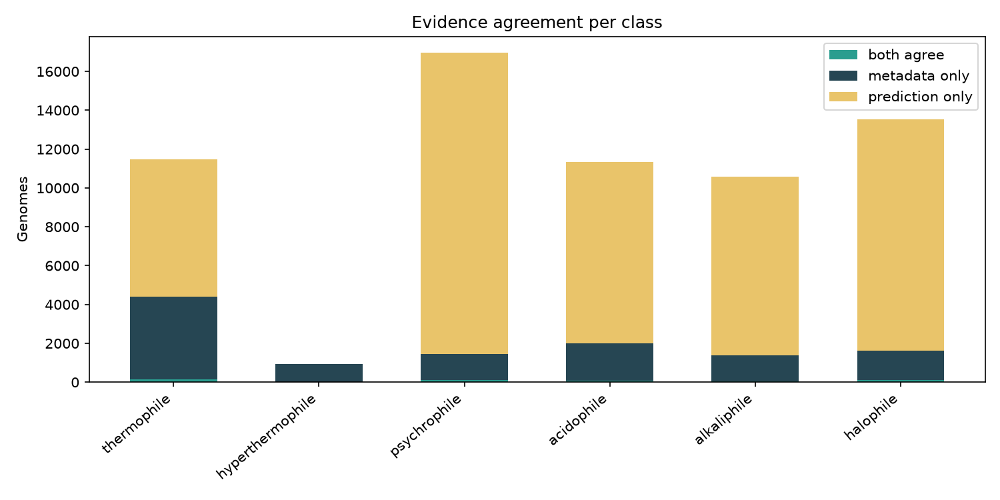
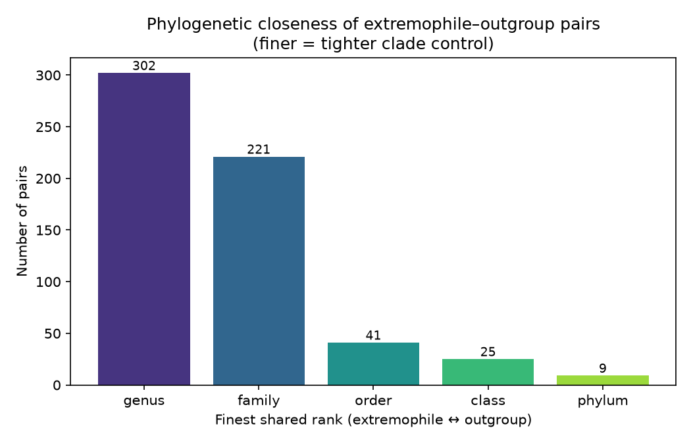
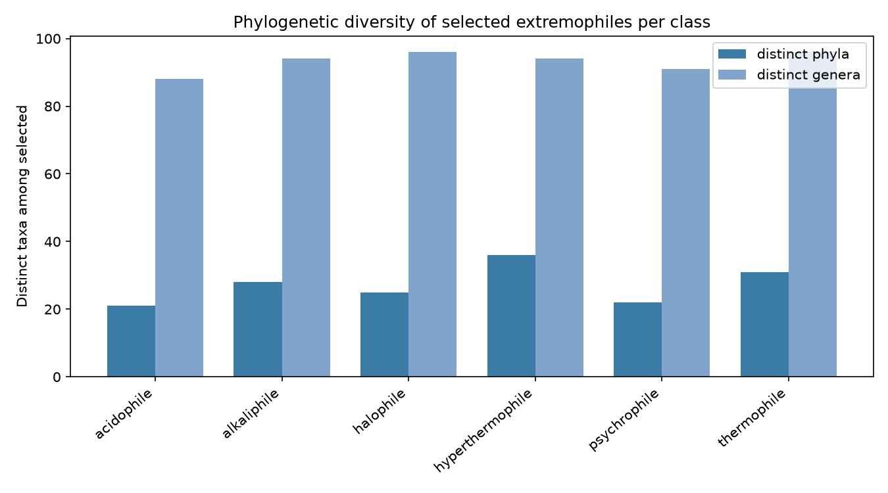

# Lab Notebook — Extremophilic Protein Translator

A running log of pipeline development: steps taken, key metrics, and figures.
Newest entries are appended at the bottom. For *what the pipeline is*, see
[README.md](README.md); this file records *what was actually done and found*.

- **Project:** database of secreted proteins from GTDB extremophiles for
  protein-language-model fine-tuning.
- **Data release:** GTDB **r232**.
- **Compute:** biotite SLURM cluster (`/groups/cress/projects/jaymin/IS1111/`);
  data pre-downloaded and pre-parsed. SignalP 6.0 installed on biotite.

---

## Summary metrics (running)

| Metric | Value |
|--------|-------|
| GTDB release | r232 |
| Species representatives (total) | **199,923** |
| — Bacteria | 189,801 |
| — Archaea | 10,122 |
| Reps with `ncbi_isolation_source` | 94,977 (48%) |
| Reps with isolation-source extremophile flag | 9,492 |
| Reps with organism-name extremophile signal | 12,193 |

---

## Stage 01 — GTDB indexing

**Goal:** parse GTDB r232 metadata, filter to species representatives, and
build accessors mapping each genome to its on-disk proteome / genome files.

**What was done**
- Verified the on-biotite data layout matches the documented conventions
  (`gtdb/` metadata + per-genome `.faa.gz`/`.fna.gz`, `work/` combined FASTA +
  coords + genome index). All file-format conventions confirmed:
  - genome id keeps GTDB prefix (`GB_`/`RS_`); combined FASTA headers are
    `>{GENOME}~{PROTID}`; `genome_index.tsv` is headerless `<bare_acc>\t<abs_path>`.
- Wrote `src/eptrans/gtdb.py`: metadata parsing, representative filter,
  taxonomy expansion (`d__…;p__…` → per-rank columns), and a `GenomeIndex`
  accessor that resolves an accession to its `.faa.gz` and `.fna.gz` paths.
- `scripts/01_index_gtdb.py` produces `results/gtdb_reps_metadata.parquet` and a
  per-phylum bar chart.

**Key metrics**
- **199,923** species representatives (189,801 bacteria + 10,122 archaea) —
  internally consistent with the 199,923-row `genome_index.tsv` (1:1 coverage).
- Metadata: 113 columns; environment proxy is `ncbi_isolation_source` (col 62).
- QC fields available: `checkm2_completeness`, `checkm2_contamination`
  (defaults: completeness ≥ 90, contamination ≤ 5).

**Figure** — representatives per phylum (validation sample; the full run
produces the same over all reps):

**Validation:** parser tested on a staged r232 metadata sample (51 reps),
robust to embedded newlines in free-text NCBI fields. 6 unit tests pass
(`tests/test_gtdb.py`).

---

## Stage 01b — Metadata-based extremophile flagging

**Goal:** map isolation-source (and, weakly, organism-name) text to candidate
extremophile classes, with retained evidence strings for auditability.

**What was done**
- Built a curated keyword dictionary in `src/eptrans/binning.py`, grounded in
  the *actual* r232 isolation-source vocabulary (tabulated the most common
  values first). Classes: thermophile, hyperthermophile, psychrophile,
  acidophile, alkaliphile, halophile.
- Handled deliberate ambiguities:
  - `soda lake` → **halophile + alkaliphile** (hypersaline *and* alkaline)
  - `salt marsh` (tidal) → **not** halophile; `basalt` → not halophile
  - `cold seep` → **not** psychrophile (ambient deep-sea, not cold-adapted)
  - `hydrothermal sulfide chimney` → thermophile + hyperthermophile
- Organism-name signals collected **separately and down-weighted**, because
  genus names correlate with clade and would leak phylogeny into the label.
- Every match retains the substring that triggered it (`*_evidence` columns).
- `scripts/01b_flag_metadata.py` → `results/metadata_flags.parquet` + figure.

**Key metrics** (of 199,923 reps; isolation-source evidence)

| Class | isolation-source | organism-name |
|-------|-----------------:|--------------:|
| thermophile | 4,415 | 3,690 |
| hyperthermophile | 949 | 52 |
| psychrophile | 1,454 | 681 |
| acidophile | 1,999 | 6,649 |
| alkaliphile | 1,394 | 422 |
| halophile | 1,617 | 1,642 |

**Figure** — metadata flags by class (left: isolation source split by domain;
right: isolation-source vs organism-name evidence):

**Observation / design validation:** for **acidophile**, organism-name evidence
(6,649) far exceeds isolation-source evidence (1,999) — largely the genus
`Acidobacterium` / class `Acidobacteriae`, i.e. taxonomic names rather than
habitat. This is exactly the clade-vs-trait confound the pipeline guards
against, and why organism-name signals are never used alone for a confident
label. Archaea are enriched in thermophile / hyperthermophile / halophile
classes, as expected.

---

## Stage 02 — GenomeSPOT wrapper + prediction parsing

**Goal:** wrap GenomeSPOT to predict temperature / pH / salinity / oxygen from a
genome's DNA + protein FASTA, and parse its output into a tidy per-genome table.

**What was done**
- Installed GenomeSPOT (Barnum et al. 2024) into a dedicated `genomespot` env
  with the **critical** pins: `scikit-learn==1.2.2` (README: essential — models
  mispredict on other versions) and `hmmlearn==0.3.0`.
- Wrote `src/eptrans/genomespot.py`: subprocess wrapper around
  `python -m genome_spot.genome_spot` + parsers for `.predictions.tsv` /
  `.predictions.json`. Flattens 10 targets × {value, error, is_novel, warning}
  into a per-genome row, plus a `__suspect` flag per trait.
- Handled interpretation subtleties: `is_novel` (features unusual vs 98% of
  training data) and `warning` clamping — a `min_exceeded` on salinity min /
  optimum at 0 is benign and explicitly **not** flagged suspect.
- `scripts/02_run_genomespot.py`: serial/local driver over an accession list
  using the `GenomeIndex` accessors.

**Validation** — ran on the shipped test genome `GCA_000172155.1`; output
reproduces the README reference exactly:

| target | value | error | flag |
|--------|------:|------:|------|
| temperature_optimum | 22.95 °C | 6.48 | — |
| ph_optimum | 7.07 | 0.91 | — |
| salinity_optimum | 0.20 % w/v | 1.94 | — |
| salinity_min | 0 | 1.18 | min_exceeded (benign) |
| oxygen | tolerant | 0.974 | — |

6 parser tests added; **32 tests total passing**. GenomeSPOT repo + models
archived as an artifact (`genomespot_repo.tar.gz`) for reproducible reuse.

---

## Stage 02b — Reconcile precomputed GenomeSPOT predictions

**Goal:** reuse the GenomeSPOT paper's precomputed predictions (GTDB **r214**)
for r232 reps, compute the recompute **delta**, and emit a reconciled TSV with
genome absolute paths.

**What was done**
- Established that the paper applied GenomeSPOT to GTDB **r214** (abstract:
  "all 85,205 species"). The per-genome predictions are **not** in the repo; the
  `analyze_all_species` notebook reads them from a local `data/predictions_gtdb/`
  and merges to a table it calls `supplementary_data_4.tsv` (presumed the paper's
  Supplementary Data 4).
- Wrote `src/eptrans/reconcile.py` with **three-tier accession matching**
  (strongest first), recording which level matched for auditability:
  1. `exact` — full bare accession incl. source prefix + version
  2. `noversion` — GCA/GCF + numeric, ignoring `.version` (version bumps)
  3. `assembly` — numeric id only (bridges GenBank↔RefSeq `GCA`↔`GCF`)
- r232 reps with no match → **delta** (need fresh GenomeSPOT); precomputed rows
  matching no r232 rep → **dropped** (organism no longer a rep).
- `attach_genome_paths()` adds absolute `.fna.gz` paths from `genome_index.tsv`.
- `scripts/02b_reconcile_predictions.py` emits the reconciled TSV (+ delta
  accession list, stats JSON, summary figure).

**Validation** — the true reuse fraction needs the real Supp Data 4 (bioRxiv
supplementary blocked from this environment; pending user download). Verified
end-to-end on a **synthetic precomputed set** built from real r232 accessions
with injected version-bumps and GCA↔GCF swaps (75% coverage, 3,000 dropped rows):

| bucket | count | note |
|--------|------:|------|
| reuse: exact | 89,965 | identical accession |
| reuse: noversion | 29,989 | version bump |
| reuse: assembly | 29,988 | GCA↔GCF swap |
| delta (recompute) | 49,981 | not in precomputed |
| dropped precomputed | 3,000 | not a rep in r232 |

All 199,923 genome paths attached. 8 reconcile tests added; **40 tests total**.

> **Note:** figure/counts above are the synthetic validation. Real r214→r232
> reuse fractions will be produced once Supplementary Data 4 is loaded.

---

## Stage 03 — Combined environmental binning logic

**Goal:** reconcile the two independent evidence sources (metadata flags +
GenomeSPOT predictions) into a final per-class extremophile label with a
confidence tier, plus a `confident_mesophile` flag for outgroup selection.

**Combination rule** (`eptrans.binning.combine_label`):

| metadata | prediction | → label | confidence |
|----------|-----------|---------|-----------|
| class X | class X | X | **high** (agree) |
| — | class X | X | **medium** (prediction only) |
| class X | — / conflict | X | **low** |
| — | — | (none) | none |

- `confident_mesophile` = all predicted optima inside the mesophile envelope
  (temp 20–40 °C, pH 6–8, salinity ≤3 % w/v) **and** no metadata extremophile
  flag — the pool from which phylogenetically-matched outgroups are drawn.
- `scripts/03_combine_bins.py` writes `combined_labels.{parquet,tsv}` with
  per-class booleans, final label, confidence, and mesophile flag; plus two
  figures (class counts by tier; metadata-vs-prediction agreement per class).

**Validation** (metadata flags + *synthetic* predictions, n=199,923): pipeline
runs end-to-end; with random synthetic predictions "both agree" is minimal and
"prediction only" dominates (expected for random data). Real GenomeSPOT
predictions will concentrate agreement in the metadata-flagged classes. Figures:

> Counts are synthetic-prediction placeholders; final numbers await real
> GenomeSPOT predictions (Supp Data 4 + delta recompute).

---

## Stage 04 — Phylogenetically-controlled genome selection

**Goal:** satisfy the two competing methodological constraints so the downstream
model learns the *trait*, not the *clade*:
1. **Diversity** — extremophiles for each class span the tree (cap picks per
   lineage so no clade dominates).
2. **Matched outgroups** — each extremophile paired with a phylogenetically
   *close* confident mesophile (same genus → family → … ), so extremophile and
   mesophile can't be separated by clade alone.

**What was done** (`src/eptrans/selection.py`)
- `select_extremophiles()`: diversity cap of N per lineage-rank (default 5 per
  family), preferring high-confidence labels.
- `find_outgroup()`: walks genus → family → order → class → phylum, returning
  the closest unused confident mesophile and recording the matched rank.
- `select_with_outgroups()`: full pipeline → extremophiles, outgroups, pairs.
- `scripts/04_select_genomes.py` writes the four tables + two figures.

**Validation** (synthetic combined labels; 100 per class, cap 5/family):

| metric | value |
|--------|------:|
| extremophiles selected | 600 |
| outgroups matched | 598 / 600 |
| pairs sharing **genus** | 302 |
| pairs sharing **family** | 221 |
| pairs sharing order/class/phylum | 41 / 25 / 9 |

Selected extremophiles per class span **21–36 distinct phyla** and ~88–96
distinct genera — high diversity with tight per-pair clade matching.

8 selection tests added; **48 tests total**.

---

## Stage 05 — SignalP 6.0 wrapper + secreted-protein extraction

**Goal:** identify and extract secreted / cell-surface-exposed proteins (those
carrying a signal peptide) from the selected genomes' proteomes.

**Secreted definition:** SignalP 6.0 class ∈ {SP, LIPO, TAT, TATLIPO, PILIN}
(i.e. any predicted signal peptide; class `OTHER` = not secreted).

**Host reconnaissance (biotite)**
- SignalP 6.0 is a **pyenv shim** (`/home/jayminp/.pyenv/shims/signalp6`,
  pyenv 3.11.3), **not** on the default non-login PATH. Jobs must
  `export PYENV_ROOT="$HOME/.pyenv"; export PATH="$PYENV_ROOT/bin:$PYENV_ROOT/shims:$PATH"` first.
- Confirmed CLI:
  `signalp6 --fastafile <faa> --output_dir <dir> --format {txt,none} --organism other --mode {fast,slow}`.
- ⚠️ **Model weights are not installed** — `signalp/model_weights/` contains only
  a README (no `.pt` files), so no mode can currently run (fast mode errors on the
  missing distilled model). The weights are license-gated (DTU academic download)
  and must be installed on the host before real runs.

**What was done**
- `src/eptrans/signalp.py`: parser for `prediction_results.txt` (exact format
  taken from the installed SignalP source), `SignalPrediction` dataclass with
  `is_secreted`, `extract_secreted()` (precursor or mature chain via cleavage
  site), `summarize()`, and command builder.
- `scripts/05_run_signalp.py`: `--emit-slurm` writes a SLURM array job (pyenv
  export baked in; decompresses `.gz` proteomes; one genome per array task); the
  default mode parses per-genome outputs → secreted-protein FASTA
  (`>{GENOME}~{PROTID}` headers) + per-protein table + summary JSON.

**Validation** (parser + extraction on a synthetic SignalP output set that
reproduces the exact 6.0 format): 2 genomes, 5 proteins → 3 secreted (60%);
class filtering, cleavage-site math (mature = residues after cleavage), and
`{GENOME}~{PROTID}` headers all correct. `--emit-slurm` generated a 600-task
array over the selected extremophiles. 7 signalp tests; **55 tests total**.

---

## Pending

- **Stage 06** — labeled dataset assembly (secreted proteins × extremophile class).
- **Stage 07** — end-to-end local pilot + push.
- **Stage 06** — labeled dataset assembly (leakage-aware splits).
- **Pilot** — end-to-end run on a small genome set + report.

_Infrastructure notes: biotite SSH + scratch dir + GitHub credential all
configured. Job submission via SLURM (`standard`/`memory`/`gpu` partitions)._
